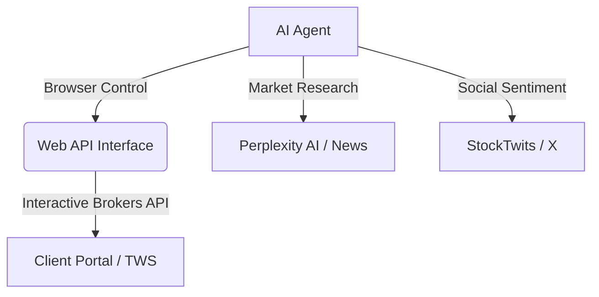

# 🦅 Nexus Quant: Autonomous Trading Intelligence

Nexus Quant is a sophisticated, AI-driven trading suite designed for the modern quantitative effort. It bridges Large Language Models (LLMs) with professional-grade execution through a unified, dockerized gateway for **Interactive Brokers (IBKR)**.


## 🌟 Key Capabilities

*   **🤖 Autonomous Intelligence**: Powered by `browser-use` and LangChain, the agent browses markets, interprets news, and executes trades based on complex reasoning.
*   **🔌 Unified execution Gateway**: A robust Web API layer that abstracts IBKR's complexity into a manageable, containerized service.
*   **📊 Multi-Channel Intelligence**:
    *   **Market Scanners**: Automated scanning for "Most Active" stocks.
    *   **Social Alpha**: Sentiment extraction from StockTwits and social feeds.
    *   **Research Integration**: Deep-dive analysis via Perplexity AI API.

---

## 🏗️ Architecture



---

## 🚀 Quick Start

### 1. Launch the Execution Gateway (Web API)
The core infrastructure runs in Docker for maximum reliability.

```bash
# Set your IBKR credentials
export IBKR_ACCOUNT_ID="your_account_id"

# Launch the container
docker-compose up -d
```
Visit `http://localhost:5056` to authenticate and view the dashboard.

### 2. Activate the AI Trading Agent
The agent lives in the `ai-agent` directory and uses a Python virtual environment.

```bash
cd ai-agent
python3 -m venv venv
source venv/bin/activate
pip install -r requirements.txt

# Run your first strategy
python3 agent.py
```

---

## 🛠️ Configuration

The agent's behavior is defined in `agent.py`. You can customize the `interactive_brokers_scanner_prompt`, `stocktwits_prompt`, or create your own custom autonomous tasks.

Ensure you have a `.env` file in the root with your credentials:
```env
OPENAI_API_ID=sk-...
IBKR_ACCOUNT_ID=...
```

---

## ⚖️ Disclaimer

**Nexus Quant is for educational purposes only.** 
Trading financial instruments involves significant risk. The developers are not responsible for any financial losses incurred through the use of this software. Always test strategies thoroughly in a **Paper Trading** environment before deploying live capital.

---

*Engineered for the next generation of algorithmic trading.*
